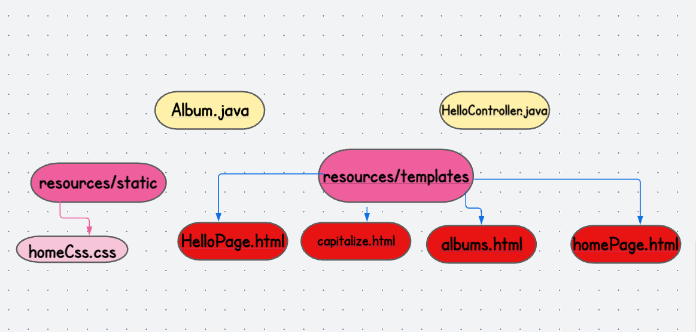

# songr

# OverView
this project is to create a new application with artifact songr with Web and Thymeleaf (and optionally Devtools) dependencies. 
you can check the albums with a given route .

# Installation 
* open your terminal

* Clone the repo
* https://github.com/mariamodat/songr.git

# Architecture
# UML diagram

